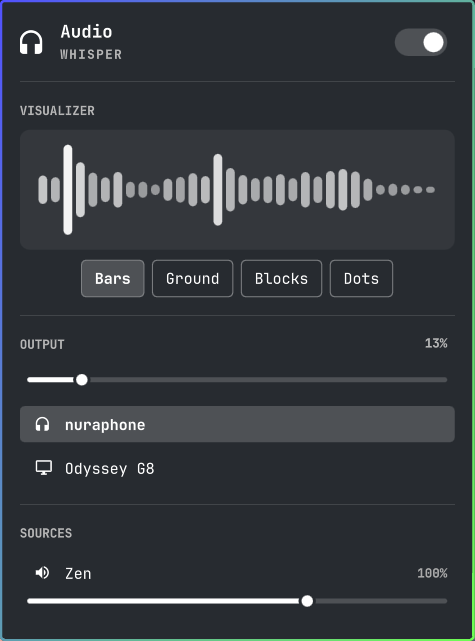
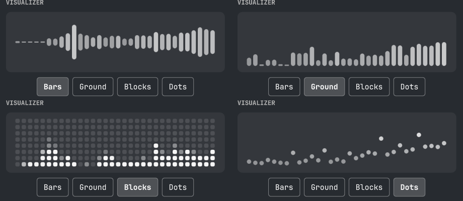

# Audio Visualizer

The Omarchy audio widget with a live spectrum analyzer in place of the
speaker icon. It is a drop-in replacement for `omarchy.audio`: same volume
slider, output picker and per-app mixer, plus a visualizer.

<p align="center">
  
</p>

[cava](https://github.com/karlstav/cava) does the FFT against the default
PipeWire output monitor and streams one ascii frame per tick on stdout;
`Cava.qml` parses those frames and `Spectrum.qml` draws them.

## Install

```bash
omarchy pkg add cava
omarchy plugin add https://github.com/koyPhish/omarchy-audio-visualizer.git --enable
omarchy plugin disable omarchy.audio
```

Plugins land disabled on `add` so you can read the code first; drop `--enable`
if you would rather review it before it runs. That last line matters: this
widget *replaces* `omarchy.audio` rather than sitting beside it. Leaving both
enabled is harmless — they use separate IPC targets and do not fight — but you
will have two audio widgets in your bar.

Requires PipeWire, which is Omarchy's default.

### Removing it

```bash
omarchy plugin remove io.github.koyphish.audio-visualizer
omarchy plugin enable omarchy.audio
```

The only thing this plugin ever writes outside its own directory is its own
widget entry in `shell.json` — the bar position it is given, and the `style`
you pick in the panel. `omarchy plugin remove` takes that entry with it.
Nothing else in your config is touched, and `cava` stays installed unless you
remove it yourself with `omarchy pkg remove cava`.

## Behaviour

<p align="center">
  
</p>

- **In the bar:** spectrum bars while audio is playing, and the ordinary
  speaker/headphone icon once it stops — the widget animates between the two
  widths rather than leaving a gap. The icon also stands in if cava never
  produces a frame, so a broken visualizer still leaves a working volume
  widget.
- **In the panel:** the full audio panel with a larger 60fps visualizer on
  top and a style picker under it.
- Works in vertical bars: bands stack down the bar and levels grow sideways.
- **On the `power-saver` profile** the visualizer pauses and cava stops, then
  comes back on its own when you leave that profile. Your chosen style is not
  touched — the panel says `Paused on power saver` and keeps it selected. Turn
  this off with `pauseOnPowerSaver` if you would rather it always run.

## Interaction

| Input  | Action                                   |
|--------|------------------------------------------|
| left   | Open the audio panel                     |
| right  | Mute / unmute everything                 |
| scroll | Output volume                            |

## Styles

`Bars` (centered), `Ground` (rising from the floor), `Blocks` (segmented
LED columns), `Dots` (a dot riding each band's level), and `Off`.

`Off` is a real off switch, not a blank style: it stops cava outright, and the
widget falls back to the plain speaker icon. You keep a working audio widget
at zero cost.

<p align="center">
  
</p>

Picking one in the panel applies to every monitor immediately and is written
straight back to `shell.json`, so it survives a restart. The panel stays open
through the write.

## One cava, however many monitors

The bar paints one surface per screen, so the widget is instantiated once per
monitor. `CavaHub.js` is a `.pragma library`, which is instantiated once per
QML engine — and the whole shell is one engine — so it is the one place every
copy can agree on. The first instance to ask becomes the owner and runs the
only cava process; the rest render from the frames it publishes. Ownership is
released on destruction and picked up by a peer within five seconds.

The panel's visualizer runs a second, finer-grained cava that lives only as
long as the panel is open.

## Settings

Change these from Setup > Plugins, or with `omarchy bar set`:

```bash
omarchy bar set io.github.koyphish.audio-visualizer bars 20
omarchy bar set io.github.koyphish.audio-visualizer channels stereo
omarchy bar set io.github.koyphish.audio-visualizer autoHide false --json
```

| Key                | Default  | What it does                                       |
|--------------------|----------|----------------------------------------------------|
| `style`            | `bars`   | `bars`, `grounded`, `blocks`, `dots`, `none` (off)  |
| `bars`             | `12`     | Bands in the bar widget                             |
| `barWidth`         | `3`      | Bar thickness in px                                 |
| `gap`              | `2`      | Gap between bars in px                              |
| `heightPercent`    | `70`     | Peak height as a percentage of the bar's own size   |
| `framerate`        | `30`     | Bar framerate; one shared process                   |
| `panelBars`        | `32`     | Bands in the panel visualizer                       |
| `panelFramerate`   | `60`     | Panel framerate; only runs while the panel is open  |
| `noiseReduction`   | `77`     | Smoothing; higher is calmer, lower is twitchier     |
| `channels`         | `mono`   | `stereo` mirrors left and right                     |
| `audioSource`      | `auto`   | PipeWire source; `auto` follows the default output  |
| `autoHide`         | `true`   | Fall back to the icon when audio is silent          |
| `pauseOnPowerSaver`| `true`   | Stop cava while the power profile is `power-saver`  |
| `hideAfterSeconds` | `3`      | How long silence must last first                    |

Boolean and numeric values need `--json` when set from the command line;
strings do not.

## Files

| File          | What it is                                              |
|---------------|---------------------------------------------------------|
| `BarWidget.qml` | Entry point: the audio panel plus the visualizer wiring |
| `Spectrum.qml`  | The renderer — one frame, four styles                  |
| `Cava.qml`      | One cava process, config to level arrays               |
| `CavaHub.js`    | Cross-monitor ownership and frame/style fan-out        |
| `Model.js`      | Audio helpers, copied from `omarchy.audio`             |

`BarWidget.qml` and `Model.js` started as copies of
`$OMARCHY_PATH/shell/plugins/panels/audio/{Panel.qml,Model.js}` (Omarchy, MIT),
so an upstream change to the audio panel has to be merged in by hand.

If you rename the entry point, restart the shell rather than rescanning —
the shell keeps resolving the old file and reports the rename as
"File name case mismatch", which is neither a case nor a filesystem problem.

## What it runs, and what it writes

Plugins run unsandboxed inside the shell, so here is everything this one
executes and every file it touches.

| Command | When | Why |
|---|---|---|
| `bash -c "exec cava -p …"` | While the widget is mounted | The visualizer. One process for the whole bar; a second one only while the panel is open. The cava config is passed through a process substitution, so no config file is written |
| `omarchy bar set <id> style <value>` | Only when you click the style picker | Persists your choice |
| `omarchy-audio-output-set-default` | Only when you click an output device | Inherited from `omarchy.audio` |
| `omarchy-audio-input-set-default` | Only when you click an input device | Inherited from `omarchy.audio` |
| `omarchy-audio-sink-availability` | Every 5s while the panel is open | Read-only |
| `omarchy-audio-output-sink` | Every 15s | Read-only |
| `omarchy-powerprofiles-list --active-state` | Every 60s, on the surface that owns cava only | Read-only; drives the power-saver pause. Not run at all when `pauseOnPowerSaver` is off |

The only file it ever writes is its **own widget entry** in
`~/.config/omarchy/shell.json` — the `style` key, and only on an explicit
click. It never writes to any other part of your config, never asks for root,
and never contacts the network.

## Credits

The audio panel — volume slider, output picker, per-app mixer, and the
keyboard navigation that goes with them — is Omarchy's `omarchy.audio` plugin
by David Heinemeier Hansson, MIT licensed, with the visualizer grafted in. See
[LICENSE](LICENSE).

Spectrum data comes from [cava](https://github.com/karlstav/cava) by Karl
Stavestrand.
